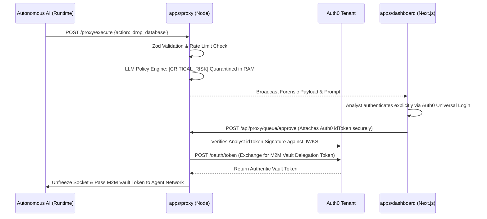

# 🛡️ Aegis Proxy: Zero-Trust Command Center for Autonomous AI

<p align="center">
  <em>An Auth0 Token Vault Integration • Enterprise Ready Monorepo</em>
</p>

## 📖 The Security Gap
As autonomous AI agents (like AutoGPT or custom LLM scripts) gain traction, giving them unrestricted access to your internal clusters or external APIs creates an immense security risk. 

**The Solution:** Aegis is a zero-trust gateway that sits between your AI agents and the world. It evaluates outgoing network requests using an LLM Policy Engine, safely passing through whitelisted actions while mathematically quarantining destructive operations continuously in RAM. Quarantined actions explicitly require **human-in-the-loop (HITL)** step-up authorization, fully secured via an end-to-end Auth0 trust chain. 

## 🚀 Architecture & Quality Standards
Aegis has been strictly architected to production-grade standards utilizing a modern **NPM Workspace Monorepo**, encompassing two primary microservices orchestrated seamlessly:

1. **`apps/proxy` (The Zero-Trust Node.js Gateway)**
   - **Strict Validation**: All incoming autonomous agent payloads are rigorously schema-validated utilizing `zod`.
   - **Rate Limiting**: Integrated `express-rate-limit` to prevent rogue agents from accidentally generating DDoS loops against the gateway.
   - **Structured Logging**: Employs `pino` for highly parseable, enterprise-ready JSON logging instead of archaic shell printing.
   - **Graceful Shutdown**: Intercepts `SIGINT` and `SIGTERM` to safely abort hanging promises and cleanly release sockets during pipeline deploys.
   - **Zero-Trust Routes**: The core authorization API endpoints are heavily protected via the `requireAuth0JWT` cryptography middleware, strictly verifying the SOC analyst's authorization signature.

2. **`apps/dashboard` (The Next.js SOC Command Center)**
   - **Modular UX**: The dashboard leverages composable React components and robust polling hooks for a highly responsive, single-pane-of-glass interface.
   - **Sealed Token Chain**: Employs a bespoke Next.js App Router API proxy (`/api/proxy/[...path]/route.ts`) that securely extracts the active `idToken` from `@auth0/nextjs-auth0` server-side configurations, automatically attaching the authentic JWT to backend gateway traffic.

---

## 🧬 Zero-Trust Data Flow Pipeline



## ⚙️ Quick Start Installation

### 1. Configure the Environment
Ensure your Auth0 tenant keys have been strictly mapped into both environments:
- `apps/proxy/.env` (Requires your `AUTH0_DOMAIN`, `CLIENT_ID`, and `CLIENT_SECRET` for final M2M Vault acquisition).
- `apps/dashboard/.env.local` (Requires standard `@auth0/nextjs-auth0` Universal Login configurations).

### 2. Boot Using Docker Compose (Recommended)
You can instantly map the entire microservices mesh leveraging standard Node orchestration:
```bash
docker-compose up --build
```
- Custom Dashboard resolves at: `http://localhost:3000`
- Proxy Gateway resolves at: `http://localhost:3001`

### 3. Or Natively using NPM Workspaces
If you prefer running them natively on the host:
```bash
npm install
npm run dev --workspace=apps/dashboard
npm start --workspace=apps/proxy
```

## 🎬 Live Agent Simulation Testing

Aegis ships with a ready-to-use Python simulator that algorithmically proves the zero-trust workflow. 

1. Ensure the `docker-compose` mesh or local servers are actively running.
2. Initialize your local terminal simulator:
```bash
source venv/bin/activate
cd scripts/simulator
pip install -r requirements.txt
python3 autonomous_client.py
```
3. Watch as the simple **"Check Weather"** intent organically routes straight through, while the **"Delete legacy metrics"** intent aggressively hangs on the socket—requiring you to authenticate natively on the `localhost:3000` SOC Dashboard to inject your cryptographic authorization seal.

---

## 🔌 Connecting Your Custom Agents (LangChain, AutoGPT, etc.)

Connecting your own autonomous framework to the Aegis Proxy is incredibly simple. Instead of your agent executing a sensitive action or tool directly, you inject a single network request to the Aegis Gateway to mathematically ask for permission. 

### Implementation Guide (Python)

Whenever your agent decides it needs to perform an action, build a JSON payload detailing its intent, and `POST` it to the Gateway with a long timeout (to account for the human-in-the-loop delay). 

```python
import requests

AEGIS_GATEWAY = "http://localhost:3001/proxy/execute"

def execute_agent_tool(action_name, target_data, agent_reasoning):
    payload = {
        "agent_id": "my-production-agent-01",
        "action": action_name,
        "target": target_data,
        "reasoning": agent_reasoning
    }

    try:
        # NOTE: Set a high timeout. If the AI intent is flagged as destructive, 
        # Aegis will aggressively suspend the socket until a human SOC analyst
        # opens the dashboard and authenticates heavily via Auth0!
        response = requests.post(AEGIS_GATEWAY, json=payload, timeout=300)
        
        if response.status_code == 200:
            vault_token = response.json().get("auth0_vault_delegation")
            print(f"✅ Approved. Executing tool using secure Vault Token: {vault_token}...")
            return True

        elif response.status_code == 403:
            print("❌ Action Rejected by SOC Analyst.")
            # For LangChain/LlamaIndex, simply return this string to the LLM 
            # so it knows to adjust its plan and try a non-destructive method!
            return False

    except requests.exceptions.Timeout:
        print("⏰ Timed out waiting for SOC approval.")
```
